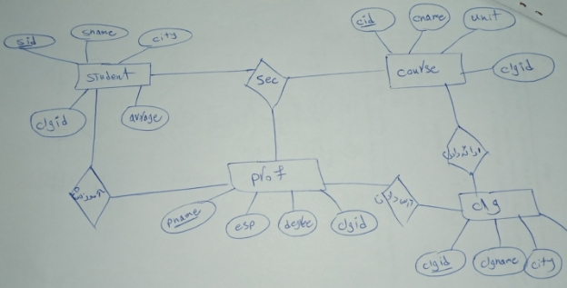

به نام خدا

پایگاه داده سامانه اموزشی دانشگاه

نمودار ER: در این نمودار روابط موجودیت های مختلف با صفت های ان مورد بررسی قرار می گیرد.

موجودیت ها شامل دانشجو,استاد,درس,دانشکده می باشد.

نمودار ان به شکل زیر است:

بعد از مرحله تحلیل و رسم نمودار ER با استفاده از ان جداول مورد نیاز هر موجودیت به طوری که در بهینه ترین حالت باشند را در SQL طراحی میکنیم کد دستورات به صورت زیر است:

با توجه به تصاویر تمام موجودیت ها و روابط به جداولی دقیقا با همان صفات و کلید اصلی نمودار ER طراحی شده است.

پس از ساخت و طراحی جداول نیاز به درج اطاعات داریم تا با استفاده از داده هایی که با دستورات SQL وارد میکنیم کویری های مناسب برای این پایگاه داده اضافه کنیم.

کد دستورات به صورت زیر است:

بعد از درج مقادیر جداول خروجی جداول به صورت زیر است:

جدول دانشجو:

جدول درس:

جدول استاد:

جدول دانشکده:

جدول SEC:

حال می توانیم با استفاده از دستورات  SQL کویری هایی زده باشیم که عبارت اند از:

